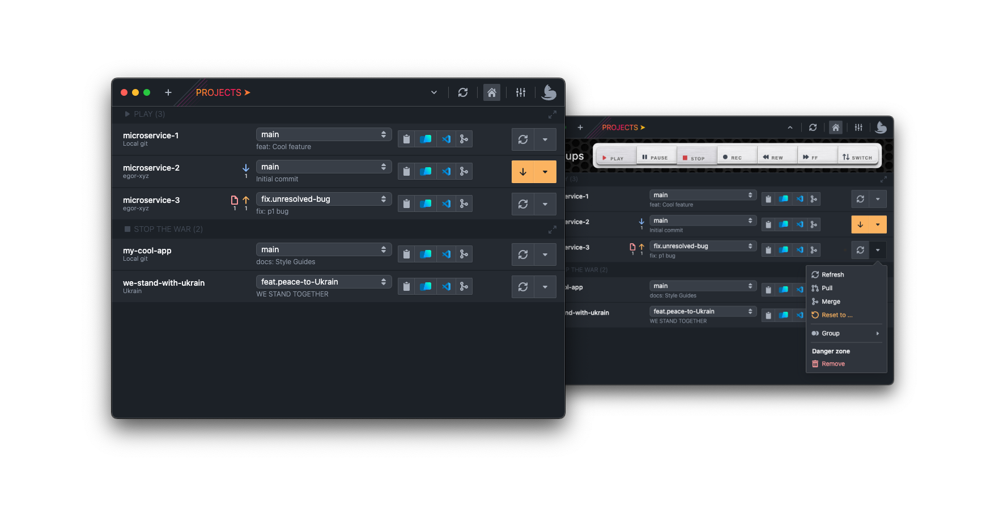

# devkitty.app website

Git (GitHub, GitLab, Bitbucket) | Jenkins | Google Translate API

<https://devkitty.app/>

Swiss army knife for developers

- Manage multiple projects
- Manage Jenkins Jobs
- Quick checkout between branches with stash or create new branches
- Auto fetch projects
- Create and view pull requests
- Quickly copy branch names
- Easily sync projects with their remote
- Open on GitHub, Bitbucket, GitLab...
- Integration with your favorite IDE or code editor
- Open in iTerm (MacOS only)
- Reveal in Finder/File Explorer
